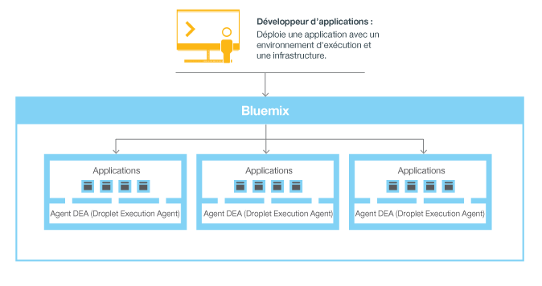
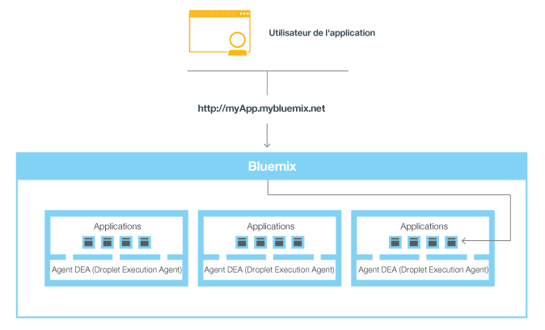
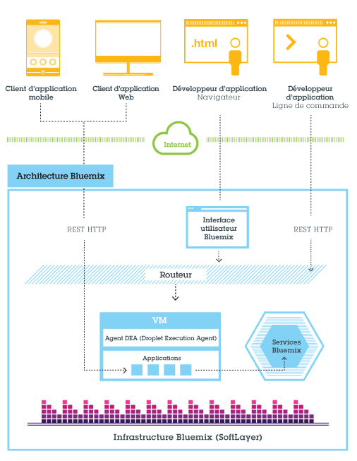

---


copyright:
  years: 2016, 2017
lastupdated: "2017-09-16"

---

{:shortdesc: .shortdesc}
{:new_window: target="_blank"}

# Fonctionnement de Cloud Foundry avec with {{site.data.keyword.cloud_notm}}
{: #howwork}

Lorsque vous déployez une application dans Cloud Foundry, vous devez configurer {{site.data.keyword.cloud_notm}} avec les informations nécessaires à la prise en charge de celle-ci.

* Dans le cas d'une application mobile, {{site.data.keyword.cloud_notm}} contient un artefact qui représente le système de back end de l'application mobile, comme les services que l'application mobile utilise pour communiquer avec un serveur.
* Dans le cas d'une application Web, vous devez vous assurer que les informations sur l'environnement d'exécution et l'infrastructure sont communiquées à {{site.data.keyword.cloud_notm}}, de sorte que {{site.data.keyword.cloud_notm}} puisse configurer l'environnement d'exécution approprié pour exécuter l'application.

Chaque environnement d'exécution, y compris mobile et web, est distinct de celui des autres applications. Les environnements d'exécution sont isolés, même si les applications sont sur la même machine physique. La figure suivante présente le flux de base suivi par Cloud Foundry pour gérer le déploiement des applications dans {{site.data.keyword.cloud_notm}} :



Figure 1. Déploiement d'une application

Lorsque vous créez une application et la déployez dans Cloud Foundry, l'environnement {{site.data.keyword.cloud_notm}} choisit un serveur virtuel approprié auquel envoyer l'application ou les artefacts représentés par l'application. Pour une application mobile, une projection de back end mobile est créée dans {{site.data.keyword.cloud_notm}}. Tout code de l'application mobile exécuté sur le cloud l'est finalement dans l'environnement {{site.data.keyword.cloud_notm}}. Pour une application Web, le code exécuté sur le cloud correspond à l'application elle-même, que le développeur déploie dans {{site.data.keyword.cloud_notm}}. Le choix du serveur virtuel dépend de plusieurs facteurs, dont :

* La charge actuelle de la machine
* Les environnements d'exécution ou les infrastructures pris en charge par le serveur virtuel

Une fois le serveur virtuel choisi, un gestionnaire d'application sur chaque serveur virtuel installe l'infrastructure appropriée et l'environnement d'exécution requis pour l'application. Celle-ci peut alors être déployée dans cette infrastructure. Ensuite, les artefacts d'application sont démarrés.

La figure suivante présente la structure d'un serveur virtuel, aussi appelé agent DEA (Droplet Execution Agent), sur lequel plusieurs applications sont déployées :


Figure 2. Conception d'un serveur virtuel

Sur chaque serveur virtuel, un gestionnaire d'application communique avec le reste de l'infrastructure {{site.data.keyword.cloud_notm}} et gère les applications déployées. Chaque serveur virtuel dispose de conteneurs pour séparer et protéger les applications. Dans chaque conteneur, {{site.data.keyword.cloud_notm}} installe l'infrastructure et l'environnement d'exécution requis pour chaque application.

Si l'application déployée dispose d'une interface Web (par exemple, une application Web Java) ou de services REST (par exemple, des services mobiles exposés publiquement à l'application mobile), les utilisateurs de cette application peuvent communiquer avec elle via des demandes HTTP normales.



Figure 3. Appel d'une application {{site.data.keyword.cloud_notm}}

Chaque application peut être associée à une ou plusieurs adresses URL, mais elles doivent toutes désigner le noeud final {{site.data.keyword.cloud_notm}}. Lorsqu'une demande arrive, {{site.data.keyword.cloud_notm}} l'examine, détermine l'application à laquelle elle est adressée, puis sélectionne l'instance de l'application qui recevra la demande.


## Architecture de Cloud Foundry dans {{site.data.keyword.cloud_notm}}
{: #architecture}

En général, il est inutile de se préoccuper des couches du système d'exploitation et de l'infrastructure lorsque vous exécutez des applications dans {{site.data.keyword.cloud_notm}}, dans Cloud Foundry. Les couches, telles que les systèmes de fichiers racine et les composants de middleware, sont masquées pour que vous puissiez vous concentrer sur le code de votre application. Cependant, vous pouvez obtenir plus de détails sur ces couches si vous avez besoin d'informations spécifiques sur l'emplacement d'exécution de votre application.

Pour plus d'informations, voir [Affichage des couches de l'infrastructure {{site.data.keyword.cloud_notm}}](/docs/manageapps/infra.html#viewinfra).

En tant que développeur, vous pouvez interagir avec l'infrastructure {{site.data.keyword.cloud_notm}} via une interface utilisateur basée sur un navigateur. Vous pouvez également utiliser une interface de ligne de commande Cloud Foundry, appelée cf, pour déployer des applications Web.

Les clients, qui peuvent être des applications mobiles, des applications exécutées en externe, des applications construites dans {{site.data.keyword.cloud_notm}} ou des développeurs qui utilisent des navigateurs, interagissent avec les applications hébergées par {{site.data.keyword.cloud_notm}}. Ils utilisent des API REST OU HTTP pour router les demandes via {{site.data.keyword.cloud_notm}} vers l'une des instances d'application ou des services composites.

La figure suivante présente l'architecture générale de Cloud Foundry sur {{site.data.keyword.cloud_notm}}.

Architecture 

Figure 4. Architecture de Cloud Foundry sur {{site.data.keyword.cloud_notm}}

Vous pouvez déployer vos applications dans différentes régions {{site.data.keyword.cloud_notm}}, pour des raisons de sécurité ou pour réduire le temps d'attente. Vous pouvez procéder au déploiement dans une région ou dans plusieurs régions.


Figure 5. Déploiement d'applications dans plusieurs régions

## Régions
{: #ov_intro_reg}

Une région {{site.data.keyword.cloud_notm}} est un territoire géographique défini sur lequel vous pouvez déployer vos applications. Vous pouvez créer des instances d'application et de service dans différentes régions avec la même infrastructure {{site.data.keyword.cloud_notm}} pour la gestion des applications et la même vue de détails de l'utilisation pour la facturation. Vous pouvez déployer vos applications dans la région la plus proche de vos clients pour réduire les temps d'attente de votre application. Pour répondre aux considérations de sécurité, vous pouvez également sélectionner la région dans laquelle conserver vos données d'application. Lorsque vous construisez des applications dans plusieurs régions et que l'une des régions devient indisponible, les applications des autres régions continuent de fonctionner. La franchise de ressources est la même dans toutes les régions que vous utilisez.

Si vous utilisez la console {{site.data.keyword.cloud_notm}}, les informations sur la plus proche région géographique viable sont automatiquement affichées. L'équilibrage de charge global pour la console garantit que, si pour une raison quelconque, la région géographique la plus proche est indisponible, votre console affichera les informations de la suivante. De la sorte, vous avez toujours accès à la console sans avoir à effectuer une action quelconque pour obtenir les informations dont vous avez besoin.

Utilisez le sélecteur de région dans la console pour filtrer votre vue. Par exemple, si vous accédez à vos applications et à vos services dans votre région Dallas - Etats-Unis, mais désirez examiner ceux de la région Londres, vous pouvez utiliser le sélecteur de région pour changer de vue :

1. Cliquez sur le lien des préférences de compte utilisateur.
2. Développez le menu **Région**.
3. Sélectionnez la région voulue dans la liste.

Le filtrage de votre vue par région vous permet également de basculer rapidement entre les vues pour travailler avec des organisations, des espaces, et des utilisateurs affectés à des régions différentes.

Si vous utilisez l'interface de ligne de commande cf pour vous connecter à la région {{site.data.keyword.cloud_notm}} dans laquelle vous désirez travailler, utilisez la commande d'API cf et spécifiez le noeud final d'API de la région. Par exemple, entrez la commande suivante pour vous connecter à la région {{site.data.keyword.cloud_notm}} Europe et Royaume-Uni :

```
cf api https://api.eu-gb.bluemix.net
```

Un préfixe unique est affecté à chaque région. {{site.data.keyword.cloud_notm}} fournit les régions et les préfixes suivants :

| **Nom de région** | **Emplacement géographique** | **Noeud final de l'API cf** |
|-----------------|-------------------------|-------------------|
| Région Sud des Etats-Unis | Dallas, US | api.ng.bluemix.net | 
| Région Royaume-Uni | Londres, Angleterre | api.eu-gb.bluemix.net | 
| Région Sydney | Sydney, Australie | api.au-syd.bluemix.net | 
| Région Allemagne | Francfort, Allemagne | api.eu-de.bluemix.net | 
{: caption="Tableau 1. Liste des régions {{site.data.keyword.cloud_notm}}" caption-side="top"}

## Résilience de {{site.data.keyword.cloud_notm}}
{: #resiliency}

{{site.data.keyword.cloud_notm}} a été conçu pour héberger des applications et des artefacts d'application évolutifs et résilients pouvant s'adapter à vos besoins, rester hautement disponibles et assurer une reprise rapide en cas de problème. {{site.data.keyword.cloud_notm}} sépare les composants qui assurent le suivi de l'état des interactions (avec état) de ceux qui n'effectuent pas de suivi (sans état). Cette distinction permet à {{site.data.keyword.cloud_notm}} de déplacer des applications de façon souple en fonction des besoins pour assurer l'évolutivité et la résilience.

Vous pouvez disposer d'une ou de plusieurs instances de votre application. Si vous disposez de plusieurs instances d'une seule application, l'application est chargée une seule fois. Toutefois, {{site.data.keyword.cloud_notm}} déploie le nombre d'instances de l'application demandé et distribue ces instances sur autant de serveurs virtuels que possible.

Vous devez sauvegarder toutes les données persistantes dans un magasin de données avec état qui se trouve hors de votre application, par exemple dans l'un des magasins de données des services de magasin de données que {{site.data.keyword.cloud_notm}} met à disposition. Etant donné que les éléments mis en cache dans la mémoire ou sur le disque peuvent ne pas être disponibles même après un redémarrage, vous pouvez utiliser l'espace mémoire ou le système de fichiers d'une instance {{site.data.keyword.cloud_notm}} unique comme cache de transaction unique temporaire. Dans le cas de la configuration d'une instance unique, la demande envoyée à votre application peut être interrompue en raison de la nature sans état de {{site.data.keyword.cloud_notm}}. Il est recommandé d'utiliser au moins trois instances pour chaque application afin d'assurer la disponibilité de l'application.

L'ensemble de l'infrastructure {{site.data.keyword.cloud_notm}}, les composants Cloud Foundry et les composants de gestion propres à {{site.data.keyword.cloud_notm}} sont hautement disponibles. Plusieurs instances de l'infrastructure sont utilisées pour équilibrer la charge.

## Intégration avec les systèmes d'enregistrement
{: #sor}

{{site.data.keyword.cloud_notm}} peut aider les développeurs en connectant deux grandes catégories de systèmes dans un environnement de cloud :

* Les *systèmes d'enregistrement* incluent les applications et les bases de données qui stockent des enregistrements métier et automatisent des processus standardisés.
* Des *systèmes d'engagement* permettent de développer l'utilité des systèmes d'enregistrement en les rendant plus attractifs pour les utilisateurs.

En intégrant un système d'enregistrement à l'application que vous créez dans {{site.data.keyword.cloud_notm}}, vous pouvez :

 * Activer une communication sécurisée entre l'application et la base de données de back end, via le téléchargement et l'installation d'un connecteur sécurisé sur site.
 * Appeler une base de données de manière sécurisée.
 * Créer des API à partir des flux d'intégration avec les bases de données et les systèmes de back end, par exemple, un système de gestion de la relation client.
 * Exposer uniquement les schémas et les tables de votre choix à l'application.
 * En tant que responsable d'organisation {{site.data.keyword.cloud_notm}}, publier une interface de programme d'application sous forme de service privé, visible uniquement des membres de votre organisation.

Utiliser le service Cloud Integration pour intégrer un système d'enregistrement à l'application que vous créez dans {{site.data.keyword.cloud_notm}}. Le service Cloud Integration permet de créer et de publier une API Cloud Integration en tant que service privé pour votre organisation.

<dl>
<dt>API Cloud Integration</dt>
    <dd>Une API Cloud Integration fournit un accès sécurisé aux systèmes d'enregistrement résidant derrière un pare-feu via des API Web. Lorsque vous créez l'API Cloud Integration, vous choisissez la ressource à laquelle vous voulez accéder via l'API Web, spécifiez les opérations qui sont autorisées et incluez les logiciels SDK et les exemples pour accéder à l'API. Pour plus d'informations sur la création d'une API Cloud Integration, voir [Initiation à Cloud Integration](/docs/services/CloudIntegration/CldInt_GetStart.html).</dd>
<dt>Service privé</dt>
    <dd>Un service privé est composé d'une API Cloud Integration, de logiciels SDK et de règles de droits. Le service privé peut également contenir de la
documentation ou d'autres éléments appartenant au fournisseur de services. Seul le responsable de l'organisation peut publier une API Cloud Integration en tant que service privé. Pour connaître les services privés à votre
disposition, cochez la case Privé dans le catalogue {{site.data.keyword.cloud_notm}}. Vous pouvez sélectionner et lier un service privé à une application sans vous connecter au service Cloud Integration. Pour lier un service privé à votre
application, procédez de la même façon que pour les services {{site.data.keyword.cloud_notm}}. Pour des informations sur la publication d'une API en tant que service privé, voir Publication d'une API en tant que service privé.</dd>
</dl>

### Scénario : Création d'une application mobile riche pour la connexion avec votre système d'enregistrement
{: #scenario}

{{site.data.keyword.cloud_notm}} fournit une plateforme dans laquelle vous pouvez intégrer votre application mobile, des services de cloud et
des
systèmes d'entreprise d'enregistrement pour générer une application qui interagit avec vos données sur site.

Par exemple, vous pouvez concevoir une application mobile pour interagir avec votre système de gestion de la relation client résidant sur site, derrière un pare-feu. Vous pouvez appeler le système d'enregistrement de manière sécurisée et optimiser les services mobiles dans {{site.data.keyword.cloud_notm}} afin
de générer une application mobile riche.

Tout d'abord, votre développeur d'intégration crée l'application de back end mobile dans {{site.data.keyword.cloud_notm}}. Il fait appel au
conteneur boilerplate Mobile Cloud utilisant le contexte d'exécution Node.js qu'il connaît le mieux.

Puis, en utilisant le service Cloud Integration dans l'interface utilisateur {{site.data.keyword.cloud_notm}}, il expose une API via un
connecteur sécurisé. Le développeur d'application télécharge le connecteur sécurisé et l'installe sur site, afin d'activer la communication sécurisée entre son  interface de programme d'application et la base de données. Après avoir créé le noeud final de base de données, il peut consulter tous les schémas et extraire les tables qu'il veut exposer à l'application en tant
qu'API pour l'application.

Il ajoute ensuite le service Push pour distribuer des notifications mobiles aux clients intéressés. Il ajoute également un service de partenaire
commercial pour écrire un tweet lorsqu'un nouvel enregistrement client est créé avec une interface de programme d'application Twitter.

En tant que développeur d'application, vous pouvez ensuite vous connecter à {{site.data.keyword.cloud_notm}}, télécharger le kit d'outils de développement Android et développer le code appelant les interfaces de programme d'application créées par le développeur d'intégration. Vous pouvez développer une application mobile qui permet aux utilisateurs d'entrer des informations sur leur périphérique mobile. Cette application crée alors un enregistrement client dans le système de gestion client. Lorsque l'enregistrement est créé, l'application crée une notification push pour périphérique mobile et un tweet pour signaler le nouvel enregistrement.
