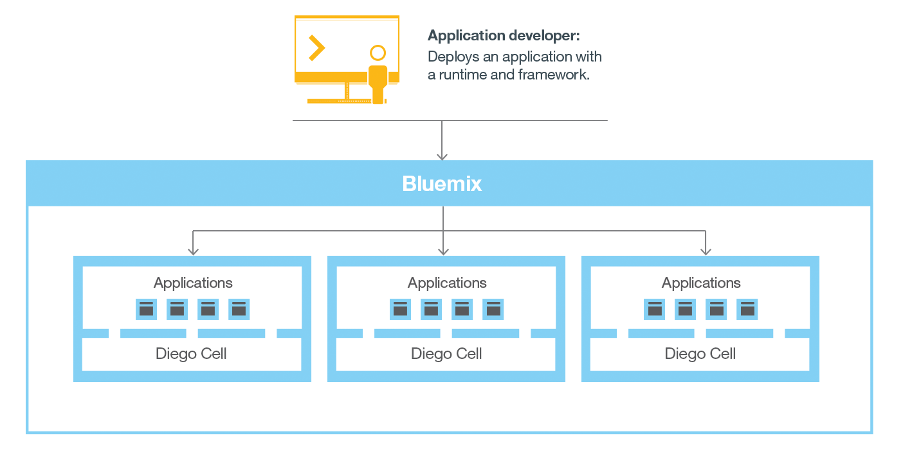
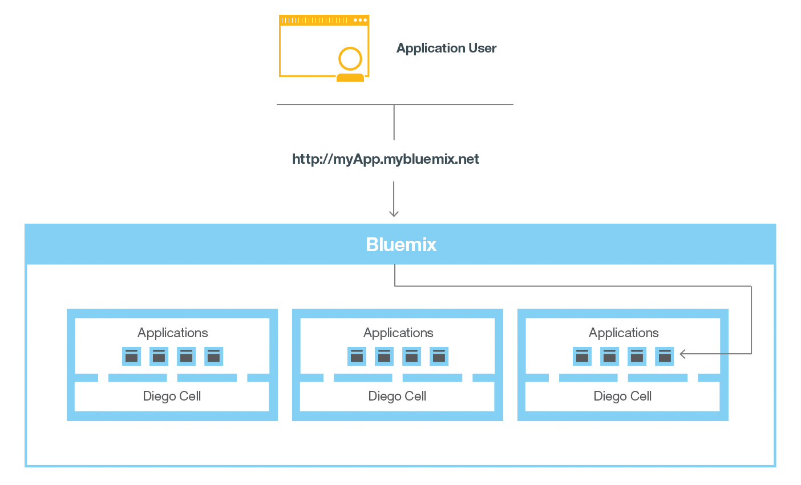
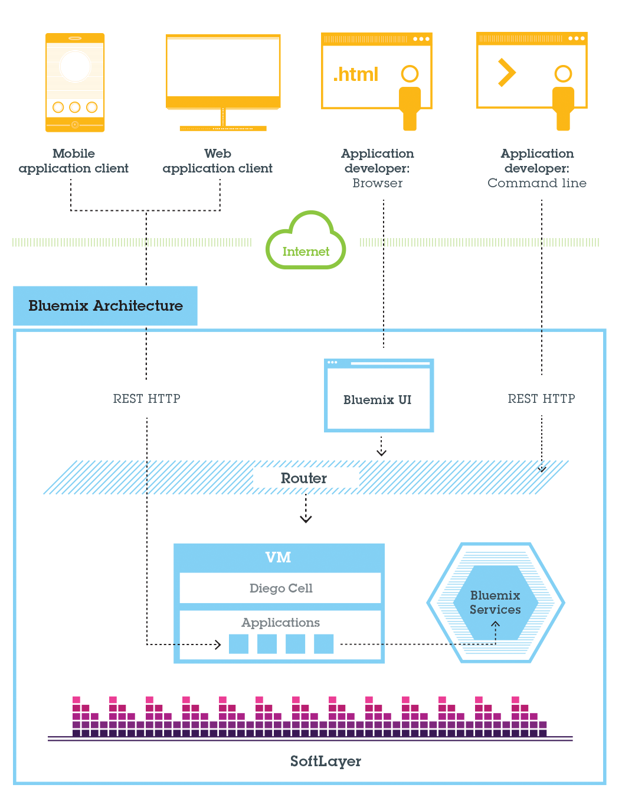

---


copyright:
  years: 2016, 2017
lastupdated: "2017-05-22"

---

{:shortdesc: .shortdesc}
{:new_window: target="_blank"}

# Bluemix Cloud Foundry 的運作方式
{: #howwork}

將某個應用程式部署至 {{site.data.keyword.Bluemix_notm}} Cloud Foundry 時，您必須使用足夠的資訊來配置 {{site.data.keyword.Bluemix_notm}}，才能支援該應用程式。

* 對於行動應用程式，{{site.data.keyword.Bluemix_notm}} 包含代表行動應用程式後端的構件，例如行動應用程式用來與伺服器進行通訊的服務。
* 對於 Web 應用程式，您必須確保將運行環境及架構的相關資訊傳遞給 {{site.data.keyword.Bluemix_notm}}，讓 {{site.data.keyword.Bluemix_notm}} 可以設定適當的執行環境來執行應用程式。

每一個執行環境（包括行動及 Web）都與其他應用程式的執行環境相隔離。即使這些應用程式位在相同的實體機器上，也一樣會隔離執行環境。下圖顯示 {{site.data.keyword.Bluemix_notm}} Cloud Foundry 如何管理應用程式部署的基本流程：



圖 3. 部署應用程式

當您建立應用程式並將其部署至 {{site.data.keyword.Bluemix_notm}} Cloud Foundry 時，{{site.data.keyword.Bluemix_notm}} 環境會判定傳送應用程式的適當虛擬伺服器，或將應用程式所代表的構件傳送至其中的適當虛擬伺服器。對於行動應用程式，將在 {{site.data.keyword.Bluemix_notm}} 上建立行動後端投射。在雲端中執行的行動應用程式的任何程式碼最終都會在 {{site.data.keyword.Bluemix_notm}} 環境中執行。對於 Web 應用程式，在雲端中執行的程式碼是開發人員部署至 {{site.data.keyword.Bluemix_notm}} 的應用程式本身。虛擬伺服器的判定是根據數個因素，包括：

* 機器上已有的負載。
* 該虛擬伺服器支援的運行環境或架構。

選擇虛擬伺服器之後，每一部虛擬伺服器上的應用程式管理程式都會為應用程式安裝適當的架構及運行環境。然後，即可將應用程式部署至該架構。部署完成之後，即會啟動應用程式構件。

下圖顯示已部署多個應用程式的虛擬伺服器結構（也稱為 Droplet Execution Agent，DEA）：


圖 4. 虛擬伺服器的設計

在每一台虛擬伺服器中，應用程式管理程式都會與 {{site.data.keyword.Bluemix_notm}} 基礎架構的其餘部分進行通訊，並管理部署至此虛擬伺服器的應用程式。每一台虛擬伺服器都具有容器，用以隔離及保護應用程式。在每一個容器中，{{site.data.keyword.Bluemix_notm}} 會安裝每一個應用程式所需的適當架構及運行環境。

部署應用程式時，如果該應用程式具有 Web 介面（例如，Java Web 應用程式）或其他 REST 型服務（例如，向行動應用程式公開的行動服務），則應用程式的使用者就可利用正常的 HTTP 要求與其進行通訊。



圖 5. 呼叫 {{site.data.keyword.Bluemix_notm}} 應用程式

每一個應用程式都可以有一個以上的相關聯 URL，但是它們必須全部指向 {{site.data.keyword.Bluemix_notm}} 端點。要求到達時，{{site.data.keyword.Bluemix_notm}} 會檢查該要求，並判定其適用的應用程式，然後選取用來接收該要求的應用程式實例。


## {{site.data.keyword.Bluemix_notm}} Cloud Foundry 架構
{: #architecture}

一般而言，您在 {{site.data.keyword.Bluemix_notm}} 的 Cloud Foundry 中執行應用程式時，不需要擔心作業系統及基礎架構層。例如根檔案系統及中介軟體元件等層會抽象化，因此您可以專注於應用程式碼。不過，如果您需要應用程式執行位置的明確資訊，可以進一步瞭解這些層。

如需詳細資料，請參閱[檢視 {{site.data.keyword.Bluemix_notm}} 基礎架構層](/docs/manageapps/infra.html#viewinfra)。

身為開發人員，您可以利用以瀏覽器為基礎的使用者介面，來與 {{site.data.keyword.Bluemix_notm}} 基礎架構互動。您也可以使用 Cloud Foundry 指令行介面（稱為 cf）來部署 Web 應用程式。

用戶端（可以是行動應用程式、外部執行的應用程式、以 {{site.data.keyword.Bluemix_notm}} 為建置基礎的應用程式，或使用瀏覽器的開發人員）可以與 {{site.data.keyword.Bluemix_notm}} 管理的應用程式互動。用戶端會使用 REST 或 HTTP API，透過 {{site.data.keyword.Bluemix_notm}} 將要求遞送到其中一個應用程式實例或複合式服務。

下圖顯示高階 {{site.data.keyword.Bluemix_notm}} Cloud Foundry 架構。



圖 1. {{site.data.keyword.Bluemix_notm}} Cloud Foundry 架構

基於延遲或安全考量，您可以將應用程式部署至不同的 {{site.data.keyword.Bluemix_notm}} 地區。您可以選擇部署至一個地區，或是部署至多個地區。


圖 2. 多地區應用程式部署

## 地區
{: #ov_intro_reg}

{{site.data.keyword.Bluemix_notm}} 地區是您可以在其中部署應用程式的已定義地理區。您可以在不同地區建立應用程式及服務實例，使用相同
{{site.data.keyword.Bluemix_notm}} 基礎架構以進行應用程式管理，以及使用相同的用量詳細資料視圖來處理計費。您可以將應用程式部署至最接近客戶的地區，以縮短應用程式的延遲時間。若要處理安全問題，您也可以選取您要保留應用程式資料的地區。在多個地區中建置應用程式時，如果某個地區變成無法使用，則位於其他地區中的應用程式會繼續執行。您使用的每個地區的資源額度都相同。

如果您使用 {{site.data.keyword.Bluemix_notm}} 主控台，會自動顯示最近健全地理區域的資訊。主控台的廣域負載平衡，確保如果因故而關閉最接近的地理區域，則您的主控台將會顯示下一個最接近地區的資訊。透過這種方式，您一律可以存取主控台，而不需要採取任何動作來存取所需的資訊。

在主控台中使用地區選取器，以過濾視圖。例如，如果您是在美國達拉斯地區存取應用程式及服務，但要檢視倫敦地區的應用程式及服務，則可以使用地區選取器來變更視圖：

1. 按一下使用者帳戶喜好設定鏈結。
2. 展開**地區**功能表。
3. 從清單中，選取您需要的地區。

根據地區過濾視圖，也可讓您快速切換視圖來處理指派給不同地區的組織、空間及使用者。

如果您使用 cf 指令行介面連接至要使用的 {{site.data.keyword.Bluemix_notm}} 地區，請使用 cf api 指令，並指定地區的 API 端點。例如，輸入下列指令以連接至 {{site.data.keyword.Bluemix_notm}} 歐洲英國地區：

```
cf api https://api.eu-gb.{{site.data.keyword.Bluemix_notm}}.net
```

唯一字首會指派給每一個地區。{{site.data.keyword.Bluemix_notm}} 提供下列地區及地區字首。

| **地區名稱** | **地理位置** | **cf API 端點** |
|-----------------|-------------------------|-------------------|
| 美國南部地區| 美國達拉斯| api.ng.bluemix.net| 
| 英國地區| 英國倫敦| api.eu-gb.bluemix.net| 
| 雪梨地區| 澳洲雪梨| api.au-syd.bluemix.net| 
| 德國地區| 德國法蘭克福| api.eu-de.bluemix.net| 
{: caption="表 1. {{site.data.keyword.Bluemix_notm}} 地區清單" caption-side="top"}

## {{site.data.keyword.Bluemix_notm}} 備援
{: #resiliency}

{{site.data.keyword.Bluemix_notm}} 的設計旨在於管理可擴充且具復原力的應用程式及應用程式構件，這些應用程式與應用程式構件可擴充以符合您的需要、維持高度可用性，而且可以快速從問題回復。{{site.data.keyword.Bluemix_notm}} 會隔開追蹤互動狀態的元件（有狀態）與不追蹤互動狀態的元件（無狀態）。這項分隔容許 {{site.data.keyword.Bluemix_notm}} 視需要彈性地移動應用程式，以達到可擴充性與備援。

您的應用程式可以有一個以上的實例處於執行中狀態。如果單一應用程式有多個實例，則該應用程式只會上傳一次。不過，{{site.data.keyword.Bluemix_notm}} 會部署所要求的應用程式實例數，並將它們盡可能地分散至眾多虛擬伺服器。

您必須將所有持續性資料儲存在應用程式之外的有狀態資料儲存庫，例如 {{site.data.keyword.Bluemix_notm}} 所提供的其中一個資料儲存庫服務上。因為記憶體中或磁碟上快取的任何內容即使在重新啟動之後可能還是無法使用，所以您可以使用單一 {{site.data.keyword.Bluemix_notm}} 實例的記憶體空間或檔案系統，作為簡要的單一交易快取。使用單一實例設定，對您應用程式的要求可能會因為 {{site.data.keyword.Bluemix_notm}} 的無狀態本質而受到中斷。最佳作法是針對每一個應用程式至少使用三個實例，以確保其可用性。

所有 {{site.data.keyword.Bluemix_notm}} 基礎架構、Cloud Foundry 元件及 {{site.data.keyword.IBM_notm}} 特有的管理元件都具有高可用性。使用基礎架構的多個實例來平衡負載。

## 與記錄系統整合
{: #sor}

在雲端環境中，{{site.data.keyword.Bluemix_notm}} 可以透過連接以下兩個廣義種類的系統來協助開發人員：

* *記錄系統* 包括用於儲存商業記錄及自動執行標準化處理程序的應用程式及資料庫。
* *參與系統* 是指延伸記錄系統的實用性並使其更吸引使用者的功能。

透過整合記錄系統與在 {{site.data.keyword.Bluemix_notm}} 中建立的應用程式，您可以執行下列動作：

 * 透過下載並安裝內部部署的安全連接器，讓應用程式與後端資料庫之間能安全地通訊。
 * 以安全的方式呼叫資料庫。
 * 從含有資料庫及後端系統（例如客戶關係管理系統）的整合流程中建立 API。
 * 僅公開要向應用程式公開的綱目及表格。
 * {{site.data.keyword.Bluemix_notm}} 組織管理員可以將 API 發佈為只有組織成員才能看到的專用服務。

若要整合記錄系統與在 {{site.data.keyword.Bluemix_notm}} 中建立的應用程式，請使用 Cloud Integration 服務。利用 Cloud Integration 服務，您可以建立 Cloud Integration API 並將 API 發佈為組織的專用服務。

<dl>
<dt>Cloud Integration API</dt>
    <dd>使用 Cloud Integration API，可以透過 Web API 對位於防火牆後方的記錄系統進行安全存取。建立 Cloud Integration API 時，您可以選擇要透過 Web API 存取的資源、指定允許的作業，並包含 SDK 和範例來存取 API。如需如何建立 Cloud Integration API 的相關資訊，請參閱[開始使用 Cloud Integration](/docs/services/CloudIntegration/CldInt_GetStart.html)。</dd>
<dt>專用服務</dt>
    <dd>專用服務包含 Cloud Integration API、SDK 及授權原則。專用服務也可能包含來自服務提供者的文件或其他項目。只有組織管理員才能將 Cloud Integration API 發佈為專用服務。若要查看您可以使用的專用服務，請選取 {{site.data.keyword.Bluemix_notm}}「型錄」中的「專用」勾選框。您可以選取專用服務，並將其連結至應用程式，而不需要連接至 Cloud Integration 服務。將專用服務連結至應用程式的方式與其他 {{site.data.keyword.Bluemix_notm}} 服務相同。如需如何將 API 發佈為專用服務的相關資訊，請參閱「將 API 發佈為專用服務」。</dd>
</dl>

### 情境：建立複合的行動應用程式以與記錄系統相連接
{: #scenario}

{{site.data.keyword.Bluemix_notm}} 提供了一個平台，您可以在該平台中整合行動應用程式、雲端服務及企業記錄系統，以提供與內部部署資料互動的應用程式。

例如，您可以建置行動應用程式，與位於防火牆後內部部署的客戶關係管理系統互動。您可以透過安全的方式呼叫記錄系統，並運用 {{site.data.keyword.Bluemix_notm}} 中的行動服務，以建置複合的行動應用程式。

首先，整合開發人員會在 {{site.data.keyword.Bluemix_notm}} 中建立行動後端應用程式。他們會使用「行動雲」樣板，該樣板使用他們最熟悉的 Node.js 運行環境。

然後，在 {{site.data.keyword.Bluemix_notm}} 使用者介面中利用 Cloud Integration 服務，透過安全連接器公開 API。整合開發人員會下載安全連接器，並以內部部署方式安裝它，以啟用其 API 與資料庫之間的安全通訊。建立資料庫端點之後，即可查看所有綱目，並擷取要以 API 形式向應用程式公開的表格。

整合開發人員會新增 Push 服務，以將行動通知提供給感興趣的客戶。此外，他們還會新增事業合作夥伴服務，以在使用 Twitter API 建立新的客戶記錄後發佈推文。

接著，身為應用程式開發人員，您可以登入 {{site.data.keyword.Bluemix_notm}}，下載 Android 開發工具箱，然後開發用於呼叫整合開發人員所建立 API 的程式碼。您可以開發一個行動應用程式，讓使用者可以在其行動裝置上輸入資訊。接著，行動應用程式會在客戶管理系統中建立客戶記錄。建立記錄後，該應用程式會向行動裝置推送通知，並開始一則關於新記錄的推文。
